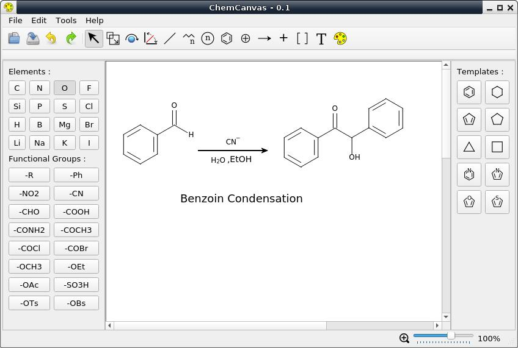
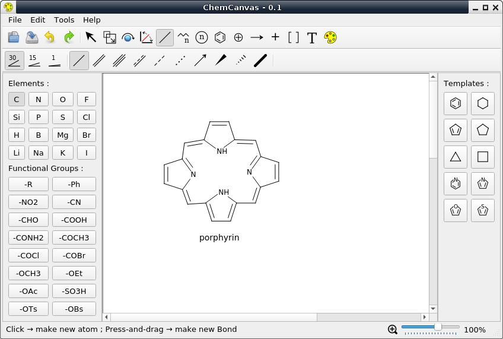
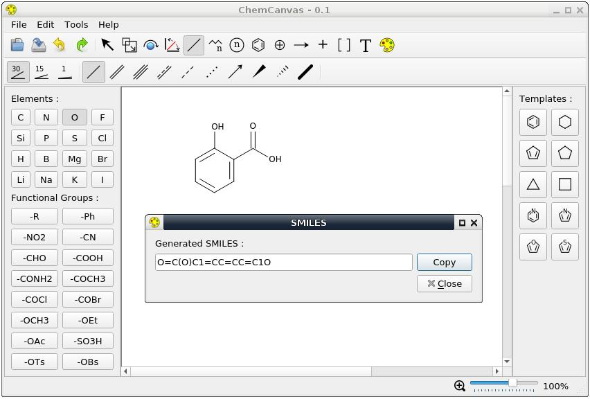

# ChemCanvas

The most intuitive opensource 2D chemical drawing tool.  


### Description

This is targeted to be the most intuitive opensource 2D chemical drawing tool.  
You can draw organic chemical structures and reactions very easily and quickly.  

### Download

|   Windows     | Linux (x86_64)| Linux (armhf) |  
| ------------- | ------------- | ------------- |  
| [EXE](https://github.com/ksharindam/chemcanvas/releases/latest/download/ChemCanvas.exe) | [AppImage](https://github.com/ksharindam/chemcanvas/releases/latest/download/ChemCanvas-x86_64.AppImage)  | [AppImage](https://github.com/ksharindam/chemcanvas/releases/latest/download/ChemCanvas-armhf.AppImage) |  

Run the AppImage package by marking it executable, and then double click.  
View changelog in [releases page](https://github.com/ksharindam/chemcanvas/releases).  

### Features
* Import from and export to SMILES, MDL Molefile, Marvin Document (MRV), ChemDraw XML (CDXML)  
* In future more chemical file formats will be supported  
* Save to PNG, SVG and Editable SVG  
* Many bond types including wavy bond, Cis/Trans, Bold double, Any Bond etc.  
* Atom, Bond and other objects coloring support  
* Aromaticity detection and add delocalization ring  


### Installation (PIP)

If you want to install using pip, first install these dependencies...  

* python3 (>=3.7)  
* python3-pyqt5  
* pytqt5-dev-tools (to generate ui and resource file)  

Inside project root directory, run following commands..  
```
pyrcc5 -o ./chemcanvas/resources_rc.py ./data/resources.qrc
pyuic5 -o ./chemcanvas/ui_mainwindow.py ./data/mainwindow.ui
sudo pip3 install .
```

To uninstall run..  
`$ sudo pip3 uninstall chemcanvas`    


### Screenshots

  


  


  

